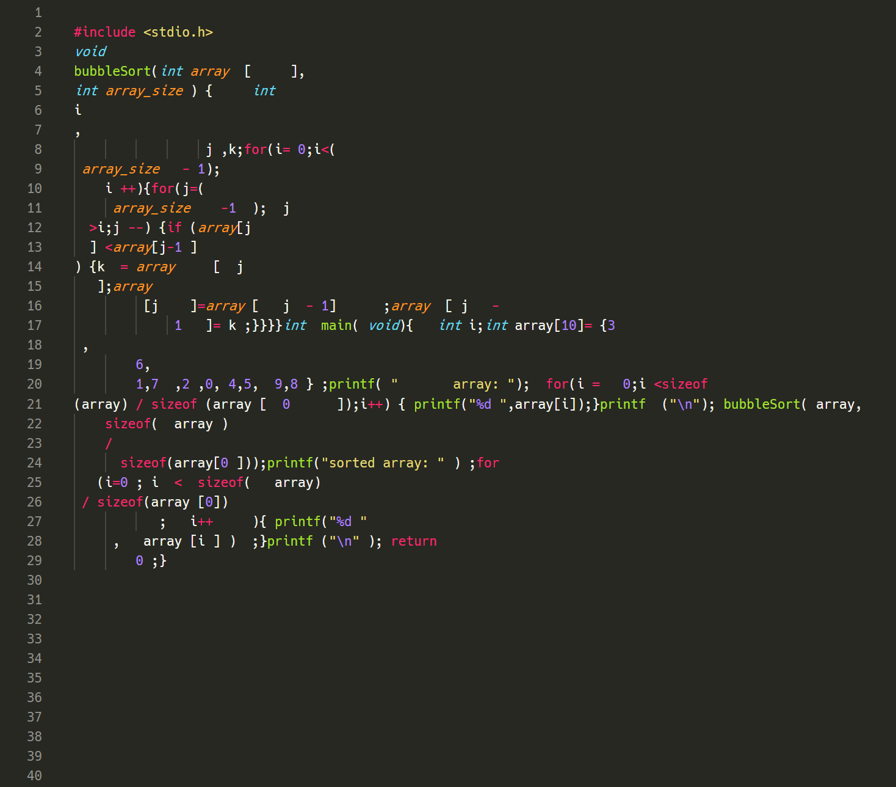

# Spoiler
Spoiler is the best c language formatter for when you want to screw everything up.

# Demo

Before using spoiler:


After using spoiler:



It could be said that this is a message to modern society, which is too caught up in superficial beauty.

## Usage
The following command will format `hoge.c`.
```bash
$ spoiler hoge.c
```

## Requirement
* g++ 9.3.0
* flex 2.6.4
* bison 3.5.1
* make 4.2.1

斬新なc言語のフォーマッターをリリースしました。
https://github.com/flat-map/Spoiler
> 世の中にはソースコードの見た目を整える「フォーマッター」が数多く存在しますが、今回は逆に「ソースコードの改行や空白をめちゃくちゃにするツール」を作ってみました。嫌な上司に提出するときや「コードを一切整えない天才プログラマー」感を出したいときなどにぜひご活用ください。